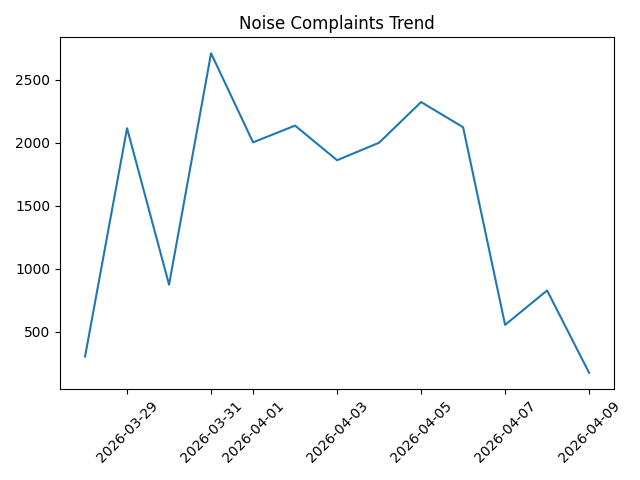

# 📊 NYC Noise Complaint Analytics Agent

## Overview

This project implements a **multi-agent analytics system** that performs the first three steps of a real-world data analysis workflow:

1. **Collect** real-world data dynamically
2. **Explore & Analyze (EDA)** the data
3. **Form and communicate a hypothesis with evidence**

The system focuses on analyzing **NYC 311 noise complaint data** using a combination of backend agents and a simple frontend interface.

---

## 🚀 System Architecture

The system follows a **multi-agent design pattern**, where each agent has a distinct responsibility:

- **Collect Agent** (`collect_agent.py`)
  - Retrieves real-time data from the NYC Open Data API
- **EDA Agent** (`eda_agent.py` + `python_eda.py`)
  - Performs data analysis using pandas
- **Hypothesis Agent** (`hypothesis_agent.py`)
  - Generates insights and explanations from analyzed data

These agents are orchestrated by a FastAPI backend.

---

## 🔍 Step 1: Data Collection

The system retrieves data from the **NYC Open Data API**:

- Dataset: 311 Service Requests (Noise Complaints)
- Method: API integration (dynamic queries at runtime)
- Supports:
  - `last X days`
  - specific date (e.g., `2024-01-01`)
  - date ranges (`between ... and ...`)

Example queries:
    - noise complaints last 7 days
    - which type of noise complaints is highest between 2024-01-01 and 2024-01-15

---

## 📊 Step 2: Exploratory Data Analysis (EDA)

EDA is performed using a **Python tool (pandas + matplotlib)**:

Key analyses:
- Total complaint count
- Top complaint types
- Borough-level distribution
- Time-based trends (daily aggregation)

Example output:
- Most frequent complaint category
- Borough with highest complaints
- Trend over time

This step involves **tool calling** where the agent executes Python-based data processing.

---

## 💡 Step 3: Hypothesis Generation

The system generates a **data-driven hypothesis** based on EDA results.

Example:
> "Noise - Residential accounts for 60% of complaints, suggesting that residential environments are the primary source of noise issues in the analyzed period."

Each hypothesis is:
- grounded in computed statistics
- supported with quantitative evidence
- adapted to the user's query

---

## 🌐 Frontend Interface

A simple HTML frontend allows users to interact with the system.

Features:
- Input box for natural language queries
- Sample questions for guidance
- Dynamic response rendering
- Visualization display

---

## 📈 Data Visualization (Grab-Bag Feature)

The system generates **trend visualizations** during EDA:

- Uses matplotlib to plot daily complaint counts
- Each query produces a **timestamped image**
- Images are saved in `app/static/`
- Displayed dynamically in the frontend

### Example Trend Visualization




---

## 📁 Artifacts (Grab-Bag Feature)

The system produces **persistent artifacts**:

- Visualization files (PNG)
- Saved per query with unique timestamps
- Serve as evidence supporting analysis

---

## 🧠 Query Understanding

The system supports flexible natural language queries:

- Time filters:
  - `last 7 days`
  - `last 30 days`
- Specific date:
  - `on 2024-01-01`
- Date range:
  - `between 2024-01-01 and 2024-01-15`

This enables dynamic and context-aware data analysis.

---

## 🛠️ Tech Stack

- **Backend**: FastAPI
- **Data Processing**: pandas
- **Visualization**: matplotlib
- **Frontend**: HTML + JavaScript
- **Data Source**: NYC Open Data API

---

## ▶️ How to Run

### 1. Start Backend
```bash
uvicorn app.main:app --reload --port 8001

### 2. Start Frontend
```bash
cd frontend
python -m http.server 3000
### 3. Open in Browser
http://127.0.0.1:3000

 Sample Queries
	•	which borough has highest complaints in last 30 days
	•	which type of noise complaints is highest in last 30 days
	•	how does noise trend change in last 30 days
	•	noise complaints last 7 days
	•	which type of noise complaints is highest between 2024-01-01 and 2024-01-15

Summary

This project demonstrates a complete data analysis agent pipeline, combining:
	•	dynamic data retrieval
	•	programmatic analysis
	•	interpretable insight generation
	•	user interaction

It mimics the workflow of a real data analyst and showcases how agent-based systems can support data-driven decision making.